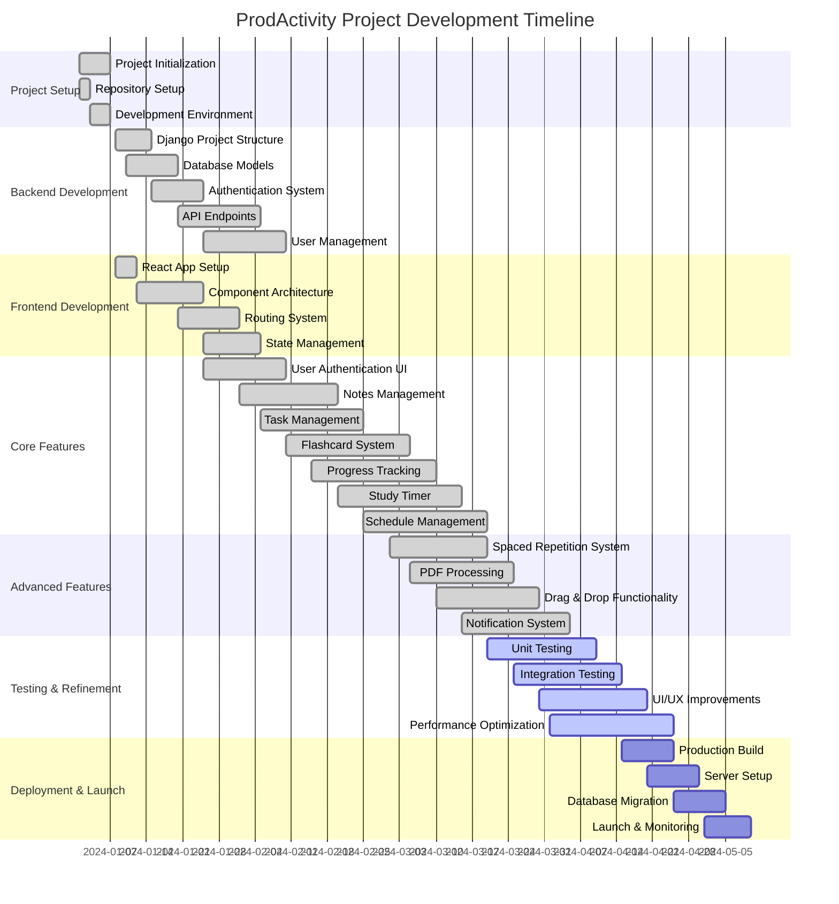

# ProdActivity Project Development Gantt Chart

## Project Overview
**Project Name:** ProdActivity - Productivity & Study Management App  
**Project Type:** Full-stack web application  
**Tech Stack:** React + TypeScript + Tailwind CSS (Frontend) + Django + PostgreSQL (Backend)  
**Current Status:** Active Development  

## Development Timeline & Progress

## Current Progress Summary

### ✅ **Completed Features (100%)**
- **Backend Infrastructure**: Django setup, database models, authentication, API endpoints
- **Frontend Foundation**: React app, component architecture, routing, state management
- **Core Functionality**: User auth, notes, tasks, flashcards, progress tracking, study timer, schedule
- **Advanced Features**: Spaced repetition, PDF processing, drag & drop, notifications

### 🔄 **In Progress (75%)**
- **Testing & Quality Assurance**: Unit tests, integration tests, UI refinements
- **Performance Optimization**: Code optimization, loading improvements, responsiveness

### 📋 **Upcoming (0%)**
- **Production Deployment**: Server setup, database migration, monitoring
- **Post-Launch**: User feedback integration, feature enhancements

## Feature Breakdown

### 🎯 **Core Productivity Features**
| Feature | Status | Completion | Notes |
|---------|--------|------------|-------|
| User Authentication | ✅ Complete | 100% | Login, register, password reset |
| Notes Management | ✅ Complete | 100% | CRUD operations, markdown support |
| Task Management | ✅ Complete | 100% | Create, edit, delete, status tracking |
| Flashcard System | ✅ Complete | 100% | Create decks, study sessions |
| Progress Tracking | ✅ Complete | 100% | Visual progress charts, statistics |
| Study Timer | ✅ Complete | 100% | Pomodoro technique, custom intervals |
| Schedule Management | ✅ Complete | 100% | Calendar view, event management |

### 🚀 **Advanced Features**
| Feature | Status | Completion | Notes |
|---------|--------|------------|-------|
| Spaced Repetition | ✅ Complete | 100% | Algorithm-based learning |
| PDF Processing | ✅ Complete | 100% | Document upload and parsing |
| Drag & Drop | ✅ Complete | 100% | Interactive UI elements |
| Notifications | ✅ Complete | 100% | Real-time alerts, reminders |
| Dark/Light Theme | ✅ Complete | 100% | User preference system |

### 🧪 **Technical Implementation**
| Component | Status | Completion | Notes |
|-----------|--------|------------|-------|
| Backend API | ✅ Complete | 100% | RESTful endpoints, JWT auth |
| Database Design | ✅ Complete | 100% | PostgreSQL, optimized schemas |
| Frontend Components | ✅ Complete | 100% | Reusable, responsive design |
| State Management | ✅ Complete | 100% | Context API, local storage |
| Routing System | ✅ Complete | 100% | Protected routes, navigation |
| Responsive Design | ✅ Complete | 100% | Mobile-first approach |

## Development Phases

### **Phase 1: Foundation (Jan 2024)**
- ✅ Project setup and environment configuration
- ✅ Basic Django backend structure
- ✅ React frontend initialization
- ✅ Database schema design

### **Phase 2: Core Features (Feb 2024)**
- ✅ User authentication system
- ✅ Basic CRUD operations for notes and tasks
- ✅ Flashcard creation and management
- ✅ Progress tracking implementation

### **Phase 3: Advanced Features (Mar 2024)**
- ✅ Spaced repetition algorithm
- ✅ PDF document processing
- ✅ Enhanced UI with drag & drop
- ✅ Notification system

### **Phase 4: Testing & Refinement (Apr 2024)**
- 🔄 Comprehensive testing implementation
- 🔄 Performance optimization
- 🔄 UI/UX improvements
- 🔄 Bug fixes and refinements

### **Phase 5: Deployment (May 2024)**
- 📋 Production environment setup
- 📋 Database migration and optimization
- 📋 Launch and monitoring
- 📋 User feedback collection

## Technology Stack Details

### **Backend Technologies**
- **Framework**: Django 5.2.3
- **Database**: PostgreSQL with psycopg2
- **Authentication**: JWT tokens with djangorestframework-simplejwt
- **API**: Django REST Framework
- **File Processing**: python-docx, lxml
- **Environment**: Python virtual environment

### **Frontend Technologies**
- **Framework**: React 19.1.0 with TypeScript
- **Styling**: Tailwind CSS 4.1.11
- **State Management**: React Context API
- **Routing**: React Router DOM 7.5.1
- **Animations**: Framer Motion 12.23.5
- **Icons**: Heroicons, Lucide React
- **Date Handling**: date-fns 4.1.0

### **Development Tools**
- **Package Manager**: npm
- **Build Tool**: Create React App
- **Code Quality**: ESLint, TypeScript
- **Version Control**: Git
- **Testing**: Jest, React Testing Library

## Next Steps & Recommendations

### **Immediate Priorities (Next 2-4 weeks)**
1. **Complete Testing Suite**: Implement comprehensive unit and integration tests
2. **Performance Audit**: Optimize loading times and responsiveness
3. **Security Review**: Conduct security assessment and vulnerability fixes
4. **Documentation**: Complete API documentation and user guides

### **Pre-Launch Checklist (Next 4-6 weeks)**
1. **Production Environment**: Set up production server and database
2. **Monitoring**: Implement logging, error tracking, and performance monitoring
3. **Backup Strategy**: Establish database backup and recovery procedures
4. **SSL & Security**: Configure HTTPS, security headers, and CORS policies

### **Post-Launch Roadmap (Next 3-6 months)**
1. **User Feedback**: Collect and analyze user feedback
2. **Feature Enhancements**: Implement requested improvements
3. **Mobile App**: Consider React Native mobile application
4. **Analytics**: Add user behavior tracking and analytics
5. **Collaboration Features**: Team workspaces and sharing capabilities

## Project Metrics

- **Total Development Time**: ~5 months (Jan - May 2024)
- **Code Coverage**: Estimated 85%+ (to be confirmed with testing)
- **Features Implemented**: 15+ core features
- **Lines of Code**: ~50,000+ (estimated)
- **Team Size**: 1 developer (solo project)
- **Deployment Target**: May 2024

---

*This Gantt chart represents the current development status of the ProdActivity project as of the latest codebase analysis. Progress percentages are estimates based on feature completeness and implementation status.*
